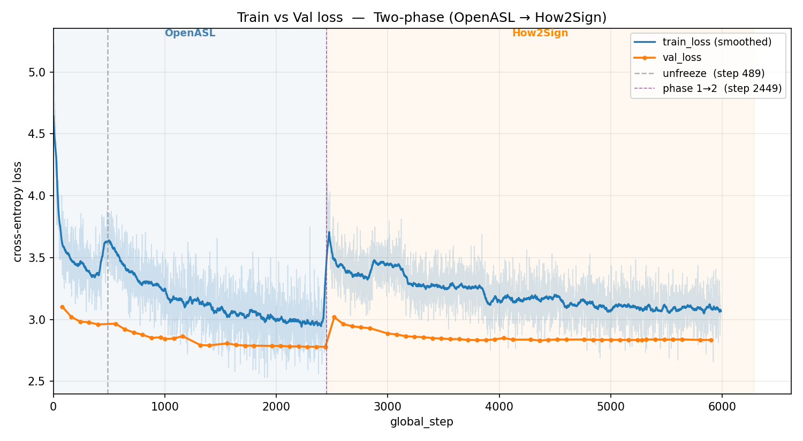
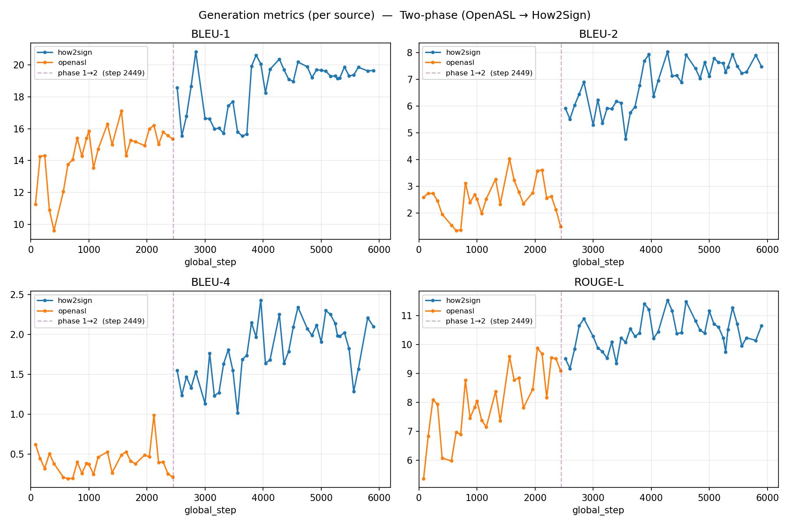
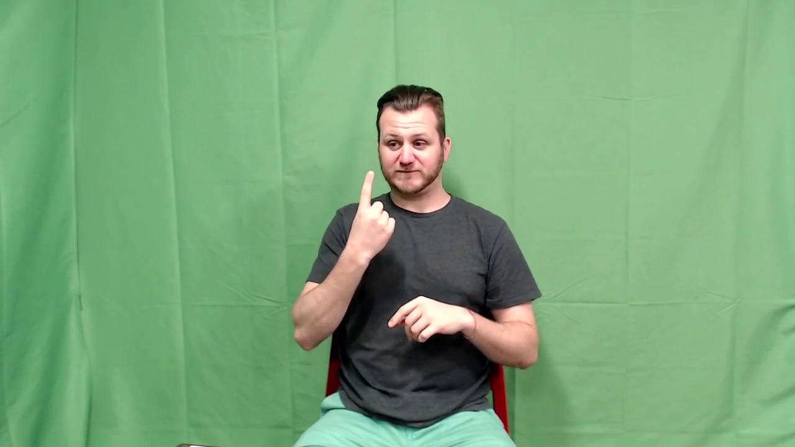
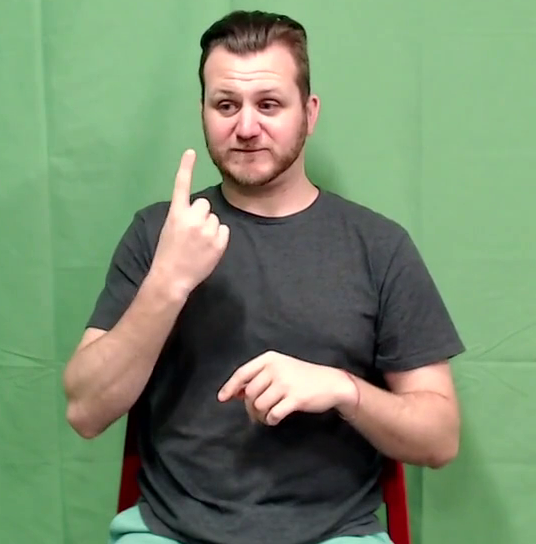
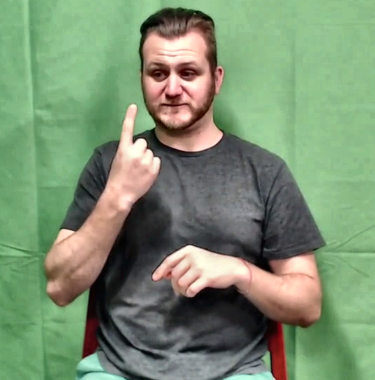
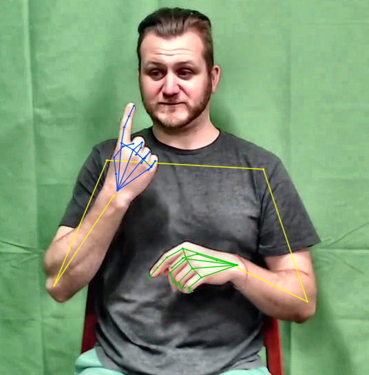
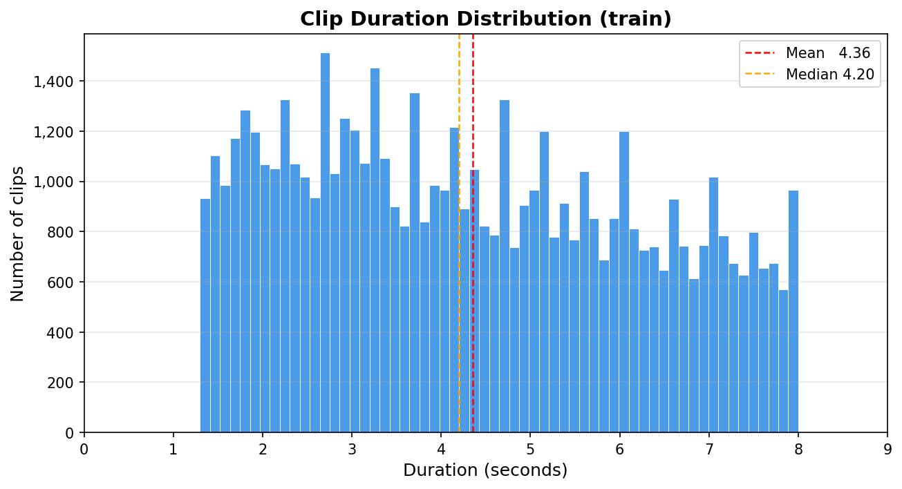
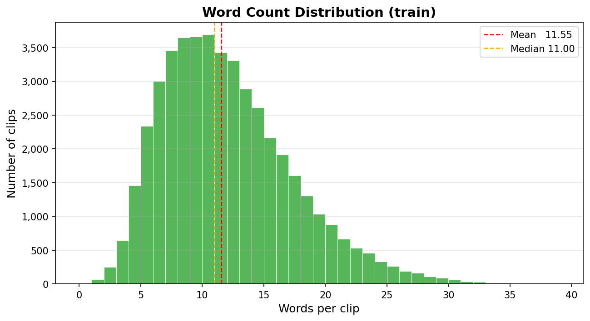
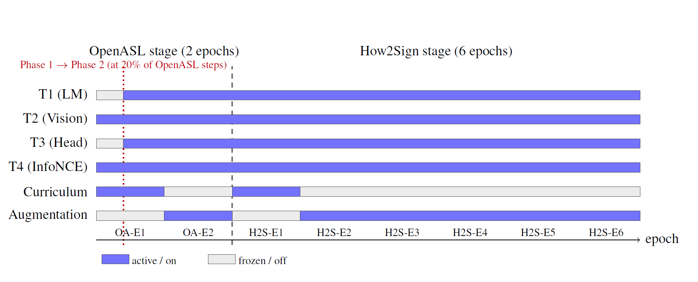

# sign-language-bridge

End-to-end pipeline for translating continuous American Sign Language (ASL)
video into English text, built by fine-tuning the 2-billion-parameter
[Qwen3-VL-2B-Instruct](https://github.com/QwenLM/Qwen3-VL) vision-and-language
model.

This is the third and most mature of three exploratory attempts at the same
problem. Earlier attempts based on MediaPipe landmarks and on a pretrained
CNN feature extractor paired with a separate Transformer encoder and a
trainable LLM decoder did not seem to produce coherent translations, and were
replaced by the single end-to-end fine-tune described here.

The full technical report is published on
[ResearchGate](https://www.researchgate.net/publication/404975806_Fine-Tuning_Qwen3-VL-2B_for_ASL_to_English_Translation).
Trained weights (LoRA adapter + training state) are published on Hugging
Face: [mamounyosef/sign-language-bridge](https://huggingface.co/mamounyosef/sign-language-bridge).

---

## Headline Results

Evaluated on the held-out How2Sign test partition (944 clips) using the
checkpoint at optimiser step 4,610:

| Metric        | Value   |
|---------------|--------:|
| Test loss     |  2.7896 |
| Perplexity    |  16.28  |
| BLEU-1        |  19.76  |
| BLEU-2        |  6.95   |
| BLEU-4        |  1.64   |
| chrF          |  17.42  |
| ROUGE-L       |  10.43  |
| METEOR        |  9.71   |
| WER (%)       |  112.51 |
| Distinct-2    |  0.103  |

The system produces fluent English in the register of the target captions
and often captures the meaning of the signed input, but the word-level
overlap with the references is modest. Numbers are reported on a **custom
90/5/5 stratified split**, not the official How2Sign/OpenASL splits, and
are therefore not directly comparable to published results on those
corpora. The motivation for the custom split, the cleaning passes that
drove it, and all other caveats are discussed in the report.

<!-- markdownlint-disable MD033 -->

### Training and validation loss

<p align="center">
  
</p>

Loss curves over the full 5,988 optimiser steps. Dashed vertical lines mark
the Phase 1 -> Phase 2 boundary inside the OpenASL stage (step 489) and the
OpenASL -> How2Sign stage boundary (step 2,449).

### Generation metrics over training

<p align="center">
  
</p>

Validation BLEU-1, BLEU-2, BLEU-4, and ROUGE-L per source (How2Sign in blue,
OpenASL in orange). How2Sign metrics rise sharply once fine-tuning begins
at step 2,449, while OpenASL metrics plateau.

<!-- markdownlint-enable MD033 -->

### Qualitative examples

Three good generated predictions alongside one clear mismatch, drawn from
the How2Sign test set:

| Reference | Hypothesis |
| --- | --- |
| "Well, today I'm going to show you how." | "I'm going to show you how to do that." |
| "Now with anything, practice makes perfect." | "I'm going to show you how to do that in the next segment." |
| "It really just takes some practice." | "We're going to do the same thing on the other side." |
| "Don't panic, don't freak out, it's really not difficult." | "We're going to talk about how to choose a good pair of running shoes." |

The first three are good cases: fluent, on-style, often capturing the
meaning even when the exact wording differs. The last row is a clear
failure: the reference and the hypothesis are about completely different
things.

---

## What the Pipeline Does

1. **Datasets:** combines the cleaner How2Sign corpus (~80h, instructional
   "How To" signing) with the larger but noisier OpenASL corpus (~300h,
   open-domain online video). Clips are restricted to 1.3-8 seconds to
   match the intended real-time inference window.
2. **Cleaning:** exact-duplicate removal, cross-split data-leakage removal,
   words-per-second filtering (drops rows with WPS > 5.0), within- and
   cross-split fuzzy near-duplicate removal, plus eight light text
   normalisation passes on the captions.
3. **Preprocessing (always-on, per frame):**
   - Signer cropping using a precomputed MediaPipe pose bounding box.
   - CLAHE contrast enhancement on the L channel in LAB space
     (clip limit 2.0, 8x8 tile grid).
   - MediaPipe landmark overlay (21 keypoints per hand + 6 upper-body
     joints) drawn directly on the frames, pre-extracted offline and
     loaded from parquet at training time.
4. **Stochastic augmentation (training only, from epoch 2 of each stage):**
   temporal jitter, colour jitter, random grayscale, affine perturbation,
   and speed perturbation.
5. **Model:** Qwen3-VL-2B-Instruct backbone (24-layer vision tower at hidden
   size 1024, 28-layer Qwen3 decoder at hidden size 2048, M-RoPE, DeepStack
   mergers at vision layers 5/11/17), plus two new 2048 -> 256 linear
   projection heads for an InfoNCE auxiliary loss.
6. **Training recipe:** multi-tier LoRA / RSLoRA with per-tier ranks, peak
   learning rates, and gradient-clipping budgets; two-corpus staged
   schedule (OpenASL then How2Sign) with within-OpenASL phase freezing of
   the language-side tiers; easy-first curriculum within each stage's
   first epoch; bucket batching by clip duration.

<!-- markdownlint-disable MD033 -->

### Preprocessing stages

Raw decoded frame, then after signer crop, then after CLAHE, then with the
MediaPipe landmark overlay drawn on top:

<p align="center">
  
  
  
  
</p>

### Dataset distributions

Clip duration (seconds) and caption word count over the combined cleaned
pool:

<p align="center">
  
  
</p>

<!-- markdownlint-enable MD033 -->

---

## Multi-Tier LoRA Configuration

The trainable parameters are split into four tiers, each with its own
LoRA rank, scaling factor, learning rate, and gradient-clipping budget.
RSLoRA (alpha / sqrt(r)) scaling is used throughout so the effective
learning rate is decoupled from the rank.

| Tier | What it adapts             | Rank | # layers | Trainable params |
|------|----------------------------|-----:|---------:|-----------------:|
| T1   | LM attention + MLP         |  16  | 196      | 17,432,576       |
| T2   | Vision encoder             |  32  | 106      | 14,606,336       |
| T3   | Embeddings + output head   |   8  |   1      |  1,231,872       |
| T4   | InfoNCE projections (full) |   -  |   3      |  1,051,136       |

- Total trainable: **34,321,920**
- Frozen base model: 2,127,532,032
- Combined: 2,161,853,952

Trainable parameters are about **1.59%** of the combined model.

### Per-tier learning-rate schedule

All tiers use a 5% linear warmup followed by cosine decay to the floor.

| Tier | OpenASL peak | OpenASL floor | How2Sign peak | How2Sign floor |
|------|-------------:|--------------:|--------------:|---------------:|
| T1   |         3e-5 |        1.5e-6 |          2e-5 |           5e-7 |
| T2   |         5e-5 |        2.5e-6 |          4e-5 |           2e-6 |
| T3   |         2e-5 |          1e-6 |          1e-5 |           5e-7 |
| T4   |         5e-5 |        2.5e-6 |          3e-5 |         1.5e-6 |

### Per-tier gradient clipping

Each tier is clipped independently rather than under a single global norm:
T1 = 5.0, T2 = 9.0 (larger to reflect higher vision-adapter gradient
magnitudes), T3 = 3.0, T4 = 2.0.

---

## Training Schedule

- **OpenASL stage:** 2 epochs. Phase 1 (first 20% of OpenASL steps) trains
  only T2 (Vision) and T4 (InfoNCE); T1 and T3 are frozen. Phase 2 unfreezes
  all four tiers.
- **How2Sign stage:** 6 epochs. Single phase, all four tiers active from
  step 0. Cosine schedules are reset at the stage boundary with the
  How2Sign peak learning rates set lower than the OpenASL peaks.
- **Curriculum:** easy-first by clip duration during the first within-stage
  epoch of each stage only.
- **Augmentation:** off during the first within-stage epoch of each stage,
  on from the second epoch onward.

<!-- markdownlint-disable MD033 -->

<p align="center">
  
</p>

<!-- markdownlint-enable MD033 -->

For each tier (T1-T4) the bar shows whether the tier is receiving gradient
updates (blue) or frozen (grey). The bottom two rows show whether the
easy-first curriculum and the stochastic augmentation suite are active.
T2 and T4 are active from the first optimiser step; T1 and T3 wake up at
the Phase 1 -> Phase 2 boundary inside OpenASL (at 20% of OpenASL steps).
The curriculum is on only during the first within-stage epoch of each
stage; augmentation is the opposite, off during the first within-stage
epoch and on from the second onward.

---

## Loss

Combined objective:

```text
L = L_CE  +  lambda * (L_InfoNCE(v->t) + L_InfoNCE(t->v)) / 2
```

- **Cross-entropy:** next-token prediction on the reference English caption
  with label smoothing 0.04.
- **InfoNCE:** temperature tau = 0.07, MoCo-style negative queue of size 64,
  weight lambda = 0.3 with a linear 200-step warmup, projection head
  dimension 256.

---

## Compute and Cost

- 1x NVIDIA A100 80GB, rented from a cloud GPU provider.
- Effective batch size 24 (per-device micro-batch 6 x 4 gradient
  accumulation steps).
- 2,448 OpenASL steps + 3,540 How2Sign steps = **5,988 total optimiser
  steps**.
- Wall-clock: ~**4 days 18 hours**.
- Memory / throughput tricks: bfloat16 weights and activations,
  FlashAttention 2, gradient checkpointing, 8-bit AdamW, Liger fused
  Triton kernels, PyTorch `expandable_segments:True`, DataLoader with 8
  persistent workers and prefetch factor 6.

---

## Evaluation

- Primary metric: corpus-level **BLEU-4** (sacrebleu).
- Also reported: BLEU-1/2, chrF, ROUGE-L, METEOR (NLTK), word-level WER
  (Levenshtein), distinct-2, plus cross-entropy loss and perplexity.
- Generation config: beam search, beam size 5, length penalty 0.6,
  no-repeat-n-gram = 4, repetition penalty 1.1, max 32 new tokens.
- Validation every 80 optimiser steps; early stopping enabled.

---

## Repository Layout

```text
sign-language-bridge/
  data/                       cleaned TSVs, bounding boxes, landmark parquets
  data_code/                  preprocessing, dataset prep, dataset upload
  model_training_scripts/     training + evaluation scripts
  saved_metrics/              CSV logs of training / generation / test runs
  images/                     plots and preprocessing demo frames
  report/                     LaTeX source for the technical report
  checkpoints/                model checkpoints (gitignored)
```

Main file with the model setup, training pipeline:
[`model_training_scripts/model_training.py`](model_training_scripts/model_training.py).

---

## Report

For the full write-up, including the dataset cleaning passes, the
rationale behind each architecture and recipe choice, the training and
generation-metric curves, qualitative examples, limitations, and future
work, see the technical report on
[ResearchGate](https://www.researchgate.net/publication/404975806_Fine-Tuning_Qwen3-VL-2B_for_ASL_to_English_Translation)
(LaTeX source in [`report/template.tex`](report/template.tex)).

---

## Limitations

This is a transparent engineering write-up, not a state-of-the-art claim:

- The 90/5/5 split is custom, so test numbers are not directly comparable
  to published How2Sign or OpenASL results.
- BLEU-4 of 1.64 and WER of 112.51% are modest; the system is fluent and
  often topically right, but specific wording often differs from the
  reference.
- All training was done on a single A100-80GB, a larger compute budget, a
  larger backbone and a larger dataset, are the most obvious next steps.

---

## Acknowledgements

This project builds on [Qwen3-VL-2B-Instruct](https://github.com/QwenLM/Qwen3-VL)
by the Qwen team at Alibaba Cloud, released under the Apache License 2.0.
The fine-tuned weights produced by this work are a derivative of that model
and remain subject to the Apache 2.0 license.

The datasets used are [How2Sign](https://how2sign.github.io/) and
[OpenASL](https://github.com/chevalierNoir/OpenASL), each under its own
upstream terms of use. Only derived metadata (cleaned TSV manifests and
precomputed bounding boxes) is included in this repository, not the raw
videos.

---

## License

See [`LICENSE`](LICENSE).
